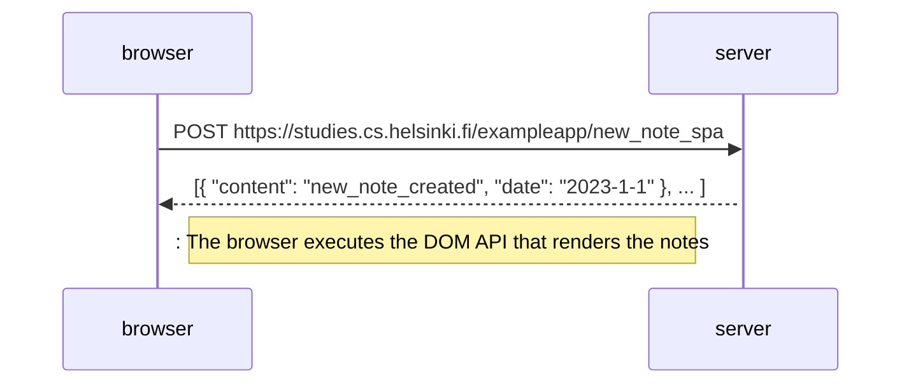

Here is a simple flow chart for single page application:

```mermaid
sequenceDiagram
    participant browser
    participant server

    browser->>server: POST https://studies.cs.helsinki.fi/exampleapp/new_note_spa
    activate server
    server-->>browser:  [{ "content": "new_note_created", "date": "2023-1-1" }, ... ]

  Note right of browser: : The browser executes the DOM API that renders the notes
```
